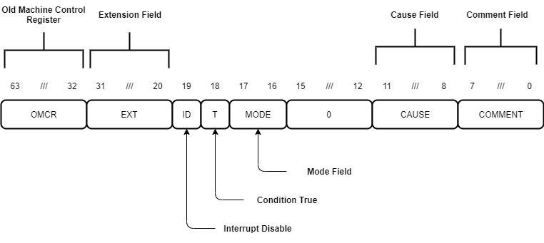

Introduction
============

MINA is an *open* instruction set architecture (ISA) designed to be extendable and easy to decode.

Current and future goals include:

* An ISA suitable for hardware implementation.
* 32-bit and 64-bit address space variants.

MINA ISA Overview
-----------------

The MINA ISA is defined as a base integer ISA with optional floating-point, SIMD and user-defined extensions.
Current base integer ISAs are *MINA32* and *MINA64*, which has not been defined yet.

Planned extensions include *FloatingMINA* (floating-point) and *VectorMINA* (single instruction, multiple data).

Events, Faults And Interrupts
-----------------------------

Unusual conditions occurring at run time are referred to as *events*.

*Faults* are events that occur synchronously to the current MINA thread; they transfer control to a *fault handler*.

*Interrupts* are similar to faults. However, interrupts occur *asynchronously* to the current MINA thread.

Data Types
-----------

The MINA ISA currently defines the following data types:

* *Byte* (8-bit)
* *Halfword* (16-bit)
* *Word* (32-bit)
* *Longword* (64-bit)

Future versions of the MINA ISA will define more data types.

Machine Control Register
------------------------

The *Machine Control Register* (MCR) is a longword register displaying information about the current state of a MINA implementation.
It is accessible through special move and load-store instructions.

   Figure 1: Machine Control Register

``OMCR`` (Old Machine Control Register) is a special 32-bit field holding a copy of the low 32 bits of MCR during fault handling.

``EXT`` (Extension) is a *read-only* 12-bit field.
All bits in this field indicate the presence or absence of certain instruction extensions.
Writes to this field are ignored. Undefined bits are hardwired to ``low``.

+-------+------------------+
| Bit   | Extension        |
+=======+==================+
| 0     | Division         |
+-------+------------------+
| 1     | Cache Control    |
+-------+------------------+
| 6     | FloatingMINA     |
+-------+------------------+
| 7     | VectorMINA       |
+-------+------------------+
| 8     | User Extension 1 |
+-------+------------------+
| 9     | User Extension 2 |
+-------+------------------+
| 10    | User Extension 3 |
+-------+------------------+
| 11    | User Extension 4 |
+-------+------------------+

``ID`` (Interrupt Disable) controls the generation of *External Interrupt* faults.
When this bit is ``high``, interrupts do not generate *External Interrupt* faults.

.. note:: The state of ``ID`` does not affect the operation of the ``WFI`` instruction.

``T`` (Condition True) controls the execution of predicated instructions.
``T`` variants execute when this bit is ``high``, ``F`` variants execute when this bit is ``low``.

``MODE`` (Mode) is a 2-bit field determining the current processor operating mode.

+-----------+------------+-----------------------+
| MODE[1:0] | Mode       | Visible Registers     |
+===========+============+=======================+
| 00        | User       | r0-r7, r8_usr-r15_usr |
+-----------+------------+-----------------------+
| 01        | Supervisor | r0-r7, r8_svc-r15_svc |
+-----------+------------+-----------------------+
| 10        | Reserved   |                       |
+-----------+------------+-----------------------+
| 11        | Reserved   |                       |
+-----------+------------+-----------------------+

.. warning:: Writing ``Reserved`` values to this field generates an *Invalid State* fault.

During fault processing, the current fault cause is loaded into the 4-bit ``CAUSE`` (Cause) field.
On reset, this field is ``1111``.

+------------+--------------------------+
| CAUSE[3:0] | Fault Cause              |
+============+==========================+
| 0000       | Misaligned Load Address  |
+------------+--------------------------+
| 0001       | Misaligned Store Address |
+------------+--------------------------+
| 0100       | Invalid State            |
+------------+--------------------------+
| 0101       | Privilege Mismatch       |
+------------+--------------------------+
| 1000       | Undefined Instruction    |
+------------+--------------------------+
| 1100       | External Interrupt       |
+------------+--------------------------+
| 1101       | User Interrupt           |
+------------+--------------------------+
| 1110       | Supervisor Call          |
+------------+--------------------------+
| 1111       | Reset                    |
+------------+--------------------------+

.. note:: It is possible to program undefined values into ``CAUSE``. However, this is discouraged as future versions of MINA may define these values. To avoid software incompatibilities, use ``User Interrupt`` for user-defined faults.

``COMMENT`` (Comment) is an 8-bit field that can be used to pass information from the current ``User`` mode thread to the ``Supervisor`` mode thread.
The ``SVCALL`` and ``FAULT`` instructions write a user-defined value into this field.

The Stack
---------

MINA uses a full-descending stack model. Push operations *decrement* the stack pointer *before* writing data onto the stack.
Pop operations *increment* the stack pointer *after* loading data from the stack.
