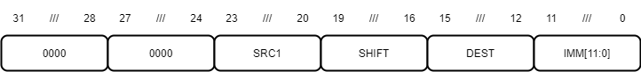

MINA32 Base Integer Instruction Set, Version 1
==============================================

The following sections describe version 1 of the MINA32 base integer ISA.

Overview
---------

MINA32 has a total of 27 registers:

* 24 32-bit general-purpose registers.
* 2 system registers.
* user-visible 32-bit program counter.

General-purpose registers ``r0-r7`` are shared across all modes, ``r8-r15`` are mode-specific.

.. note:: ``r15`` is used as a *stack pointer* (SP) for instructions that use the stack. At all other times you can treat ``r15`` as a general-purpose register.

.. note:: It is possible to access ``User`` mode registers ``r8_usr-r15_usr`` from ``Supervisor`` mode through the use of special move instructions.

The two system registers are MCR - the *Machine Control Register* - and FRET - the *Fault Return Address* register.
While limited MCR access is possible in ``User`` mode, FRET is only visible to ``Supervisor`` mode threads.

The user-visible *program counter* (PC) holds the address of the currently executing instruction.

Fault Entry And Exit
--------------------

MINA faults are handled as follows:

1. Depending on the fault cause, FRET is loaded with ``PC`` or ``PC + 4``.
2. MCR is left-shifted by ``32``. ``ID`` is pulled ``high``, ``MODE`` is set to ``10`` (``Supervisor``).
3. ``CAUSE`` is loaded with an appropriate fault code.
4. In case of a user-generated fault, ``COMMENT`` is loaded with a user-defined 8-bit value.
5. ``PC`` is set to ``0``.

To return from a fault, a fault handler must use the ``SWITCH`` instruction.
``SWITCH`` restores MCR by right-shifting it by ``32`` and resets ``PC`` to the value stored in FRET.

Instruction Formats
-------------------

There are five core instruction formats (``S``/``I``/``M``/``F``/``B``).
Instructions must be aligned on a four-byte boundary; misaligned instructions generate ``Misaligned Load Address`` faults.

The ``S``-type (Standard) format is used for most instructions that operate on registers.

   Figure 2: S-type Format

The ``I``-type (Immediate) format is the default register-immediate format.
An ``I``-type immediate is sign-extended 12-bit data (``IMM[11:0]``) left-shifted by the shift amount specified in ``SHIFT``.

   Figure 3: I-type Format

The ``M``-type (Move) format is a special register-immediate format.
An ``M``-type immediate is zero-extended 16-bit data (``IMM[15:0]``) left-shifted by ``0`` (``MOVL`` instruction) or ``16`` (``MOVU`` instruction).

   Figure 4: M-type Format

The ``F``-type (Funnel Shift) format is a special register-register format with four register operands.

   Figure 5: F-type Format

The ``B``-type (Branch) format is a special immediate format.
A program counter-relative branch offset is sign-extended 24-bit data (``IMM[23:0]``) left-shifted by ``2``.

   Figure 6: B-type Format

Instruction Summary
-------------------

Arithmetic/Divide/NOP Group (``0000``)
^^^^^^^^^^^^^^^^^^^^^^^^^^^^^^^^^^^^^^

+--------+----------+--------------------------------------+--------+
| Opcode | Mnemonic | Instruction                          | Format |
+========+==========+======================================+========+
| 0000   | ADDI     | Add Immediate                        | I      |
+--------+----------+--------------------------------------+--------+
| 0001   | MULTI    | Multiply Immediate                   | I      |
+--------+----------+--------------------------------------+--------+
| 0010   | DIVI     | Divide Immediate                     | I      |
+--------+----------+--------------------------------------+--------+
| 0011   | REMI     | Compute Remainder Immediate          | I      |
+--------+----------+--------------------------------------+--------+
| 0100   | SLTI     | Set If Less Than Immediate           | I      |
+--------+----------+--------------------------------------+--------+
| 0101   | SLTIU    | Set If Less Than Immediate Unsigned  | I      |
+--------+----------+--------------------------------------+--------+
| 0110   | NOP      | No Operation                         | I      |
+--------+----------+--------------------------------------+--------+
| 0111   | PCADDI   | Add Program Counter Immediate        | I      |
+--------+----------+--------------------------------------+--------+
| 1000   | ADD      | Add Register                         | S      |
+--------+----------+--------------------------------------+--------+
| 1001   | MULT     | Multiply Register                    | S      |
+--------+----------+--------------------------------------+--------+
| 1010   | DIV      | Divide Register                      | S      |
+--------+----------+--------------------------------------+--------+
| 1011   | REM      | Compute Remainder Register           | S      |
+--------+----------+--------------------------------------+--------+
| 1100   | SLT      | Set If Less Than Register            | S      |
+--------+----------+--------------------------------------+--------+
| 1101   | SLTU     | Set If Less Than Register Unsigned   | S      |
+--------+----------+--------------------------------------+--------+
| 1110   | SUB      | Subtract Register                    | S      |
+--------+----------+--------------------------------------+--------+
| 1111   | PCADD    | Add Program Counter Register         | S      |
+--------+----------+--------------------------------------+--------+

Logic/Bitwise Group (``0001``)
^^^^^^^^^^^^^^^^^^^^^^^^^^^^^^

+--------+----------+--------------------------------------+--------+
| Opcode | Mnemonic | Instruction                          | Format |
+========+==========+======================================+========+
| 0000   | ANDI     | Logical AND Immediate                | I      |
+--------+----------+--------------------------------------+--------+
| 0001   | ORI      | Logical OR Immediate                 | I      |
+--------+----------+--------------------------------------+--------+
| 0010   | XORI     | Logical XOR Immediate                | I      |
+--------+----------+--------------------------------------+--------+
| 0011   | NANDI    | Logical NOT-AND Immediate            | I      |
+--------+----------+--------------------------------------+--------+
| 1000   | AND      | Logical AND Register                 | S      |
+--------+----------+--------------------------------------+--------+
| 1001   | OR       | Logical OR Register                  | S      |
+--------+----------+--------------------------------------+--------+
| 1010   | XOR      | Logical XOR Register                 | S      |
+--------+----------+--------------------------------------+--------+
| 1011   | NAND     | Logical NOT-AND Register             | S      |
+--------+----------+--------------------------------------+--------+
| 1100   | POPCNT   | Compute Population Count             | S      |
+--------+----------+--------------------------------------+--------+
| 1101   | CLO      | Count Leading Ones                   | S      |
+--------+----------+--------------------------------------+--------+
| 1110   | PLO      | Find Position Of Leading One         | S      |
+--------+----------+--------------------------------------+--------+

Compare Group (``0010``)
^^^^^^^^^^^^^^^^^^^^^^^^

+--------+----------+--------------------------------------+--------+
| Opcode | Mnemonic | Instruction                          | Format |
+========+==========+======================================+========+
| 0000   | CMPI/EQ  | Compare Equal Immediate              | I      |
+--------+----------+--------------------------------------+--------+
| 0001   | CMPI/LO  | Compare Lower Immediate              | I      |
+--------+----------+--------------------------------------+--------+
| 0010   | CMPI/LS  | Compare Lower Or Same Immediate      | I      |
+--------+----------+--------------------------------------+--------+
| 0011   | CMPI/LT  | Compare Less Than Immediate          | I      |
+--------+----------+--------------------------------------+--------+
| 0100   | CMPI/LE  | Compare Less Than Or Equal Immediate | I      |
+--------+----------+--------------------------------------+--------+
| 1000   | CMP/EQ   | Compare Equal Register               | S      |
+--------+----------+--------------------------------------+--------+
| 1001   | CMP/LO   | Compare Lower Register               | S      |
+--------+----------+--------------------------------------+--------+
| 1010   | CMP/LS   | Compare Lower Or Same Register       | S      |
+--------+----------+--------------------------------------+--------+
| 1011   | CMP/LT   | Compare Less Than Register           | S      |
+--------+----------+--------------------------------------+--------+
| 1100   | CMP/LE   | Compare Less Than Or Equal Register  | S      |
+--------+----------+--------------------------------------+--------+

Register Branch Group (``0011``)
^^^^^^^^^^^^^^^^^^^^^^^^^^^^^^^^

+--------+----------+--------------------------------------+--------+
| Opcode | Mnemonic | Instruction                          | Format |
+========+==========+======================================+========+
| 0000   | RBRA     | Register Branch, Immediate Offset    | I      |
+--------+----------+--------------------------------------+--------+
| 0001   | RCALL    | Register Call, Immediate Offset      | I      |
+--------+----------+--------------------------------------+--------+
| 0010   | RET      | Return From Subroutine Call          | I      |
+--------+----------+--------------------------------------+--------+
| 1000   | ROBRA    | Register Branch, Register Offset     | S      |
+--------+----------+--------------------------------------+--------+
| 1001   | ROCALL   | Register Call, Register Offset       | S      |
+--------+----------+--------------------------------------+--------+

Memory Group (``0100``)
^^^^^^^^^^^^^^^^^^^^^^^

+--------+----------+--------------------------------------+--------+
| Opcode | Mnemonic | Instruction                          | Format |
+========+==========+======================================+========+
| 0000   | LD       | Load Word, Immediate Offset          | I      |
+--------+----------+--------------------------------------+--------+
| 0001   | LDH      | Load Halfword, Immediate Offset      | I      |
+--------+----------+--------------------------------------+--------+
| 0010   | LDB      | Load Byte, Immediate Offset          | I      |
+--------+----------+--------------------------------------+--------+
| 0011   | ST       | Store Word, Immediate Offset         | I      |
+--------+----------+--------------------------------------+--------+
| 0100   | STH      | Store Halfword, Immediate Offset     | I      |
+--------+----------+--------------------------------------+--------+
| 0101   | STB      | Store Byte, Immediate Offset         | I      |
+--------+----------+--------------------------------------+--------+
| 0110   | LDC      | Load Machine Control Register        | I      |
+--------+----------+--------------------------------------+--------+
| 0111   | STC      | Store Machine Control Register       | I      |
+--------+----------+--------------------------------------+--------+
| 1000   | RLD      | Load Word, Register Offset           | S      |
+--------+----------+--------------------------------------+--------+
| 1001   | RLDH     | Load Halfword, Register Offset       | S      |
+--------+----------+--------------------------------------+--------+
| 1010   | RLDB     | Load Byte, Register Offset           | S      |
+--------+----------+--------------------------------------+--------+
| 1011   | RST      | Store Word, Register Offset          | S      |
+--------+----------+--------------------------------------+--------+
| 1100   | RSTH     | Store Halfword, Register Offset      | S      |
+--------+----------+--------------------------------------+--------+
| 1101   | RSTB     | Store Byte, Register Offset          | S      |
+--------+----------+--------------------------------------+--------+
| 1110   | POP      | Pop Word                             | S      |
+--------+----------+--------------------------------------+--------+
| 1111   | PUSH     | Push Word                            | S      |
+--------+----------+--------------------------------------+--------+

Move Group (``0101``)
^^^^^^^^^^^^^^^^^^^^^

+--------+----------+--------------------------------------+--------+
| Opcode | Mnemonic | Instruction                          | Format |
+========+==========+======================================+========+
| 0000   | MOVI     | Move Immediate                       | I      |
+--------+----------+--------------------------------------+--------+
| 0001   | MTI      | Move If True Immediate               | I      |
+--------+----------+--------------------------------------+--------+
| 0010   | MFI      | Move If False Immediate              | I      |
+--------+----------+--------------------------------------+--------+
| 0011   | MOVL     | Move Lower Immediate                 | M      |
+--------+----------+--------------------------------------+--------+
| 0100   | MOVU     | Move Upper Immediate                 | M      |
+--------+----------+--------------------------------------+--------+
| 1000   | MOV      | Move Register                        | S      |
+--------+----------+--------------------------------------+--------+
| 1001   | SEL      | Select Register                      | S      |
+--------+----------+--------------------------------------+--------+
| 1011   | MTOC     | Move To Machine Control Register     | S      |
+--------+----------+--------------------------------------+--------+
| 1100   | MFRC     | Move From Machine Control Register   | S      |
+--------+----------+--------------------------------------+--------+
| 1101   | MTOU     | Move To User Mode Register           | S      |
+--------+----------+--------------------------------------+--------+
| 1110   | MFRU     | Move From User Mode Register         | S      |
+--------+----------+--------------------------------------+--------+

Shift Group (``0110``)
^^^^^^^^^^^^^^^^^^^^^^

+--------+----------+--------------------------------------+--------+
| Opcode | Mnemonic | Instruction                          | Format |
+========+==========+======================================+========+
| 0000   | LSL      | Shift By Immediate, Logical Left     | I      |
+--------+----------+--------------------------------------+--------+
| 0001   | LSR      | Shift By Immediate, Logical Right    | I      |
+--------+----------+--------------------------------------+--------+
| 0010   | ASR      | Shift By Immediate, Arithmetic Right | I      |
+--------+----------+--------------------------------------+--------+
| 0011   | ROR      | Rotate By Immediate, Right           | I      |
+--------+----------+--------------------------------------+--------+
| 1000   | RLSL     | Shift By Register, Logical Left      | S      |
+--------+----------+--------------------------------------+--------+
| 1001   | RLSR     | Shift By Register, Logical Right     | S      |
+--------+----------+--------------------------------------+--------+
| 1010   | RASR     | Shift By Register, Arithmetic Right  | S      |
+--------+----------+--------------------------------------+--------+
| 1011   | RROR     | Rotate By Register, Right            | S      |
+--------+----------+--------------------------------------+--------+
| 1100   | FLSL     | Funnel Shift, Logical Left           | F      |
+--------+----------+--------------------------------------+--------+
| 1101   | FLSR     | Funnel Shift, Logical Right          | F      |
+--------+----------+--------------------------------------+--------+

Control Group (``0111``)
^^^^^^^^^^^^^^^^^^^^^^^^

+--------+----------+--------------------------------------+--------+
| Opcode | Mnemonic | Instruction                          | Format |
+========+==========+======================================+========+
| 0000   | STOP     | Shut Down Processor                  | I      |
+--------+----------+--------------------------------------+--------+
| 0001   | WFI      | Wait For Interrupt                   | I      |
+--------+----------+--------------------------------------+--------+
| 0010   | SETT     | Set T Bit                            | I      |
+--------+----------+--------------------------------------+--------+
| 0011   | CLRT     | Clear T Bit                          | I      |
+--------+----------+--------------------------------------+--------+
| 0100   | SWITCH   | Switch To Saved State                | I      |
+--------+----------+--------------------------------------+--------+
| 1000   | SVCALL   | Supervisor Call                      | S      |
+--------+----------+--------------------------------------+--------+
| 1001   | FAULT    | Generate Fault                       | S      |
+--------+----------+--------------------------------------+--------+
| 1010   | MTOF     | Move To Fault RetAddr Register       | S      |
+--------+----------+--------------------------------------+--------+
| 1011   | MFRF     | Move From Fault RetAddr Register     | S      |
+--------+----------+--------------------------------------+--------+
| 1100   | MTOC2    | Move To OMCR                         | S      |
+--------+----------+--------------------------------------+--------+
| 1101   | MFRC2    | Move From OMCR                       | S      |
+--------+----------+--------------------------------------+--------+

PC-Relative Branch Group (``1000``)
^^^^^^^^^^^^^^^^^^^^^^^^^^^^^^^^^^^

+--------+----------+--------------------------------------+--------+
| Opcode | Mnemonic | Instruction                          | Format |
+========+==========+======================================+========+
| 0000   | BRA      | PC-Relative Branch                   | B      |
+--------+----------+--------------------------------------+--------+
| 0001   | BT       | PC-Relative Branch If True           | B      |
+--------+----------+--------------------------------------+--------+
| 0010   | BF       | PC-Relative Branch If False          | B      |
+--------+----------+--------------------------------------+--------+
| 1000   | CALL     | PC-Relative Call                     | B      |
+--------+----------+--------------------------------------+--------+
| 1001   | CT       | PC-Relative Call If True             | B      |
+--------+----------+--------------------------------------+--------+
| 1010   | CF       | PC-Relative Call If False            | B      |
+--------+----------+--------------------------------------+--------+

Instruction Set
---------------

ADD (Add Register): Arithmetic Instruction
^^^^^^^^^^^^^^^^^^^^^^^^^^^^^^^^^^^^^^^^^^

   Figure 7: ADD

**Assembler syntax:** ``add dest, src1, src2``

**Description:** Adds register ``src1`` to register ``src2`` and stores the result in register ``dest``.

**Operation:**

.. code-block:: c

   ADD(src1, src2, dest)
   {
       r[dest] = r[src1] + r[src2];
   }

ADDI (Add Immediate): Arithmetic Instruction
^^^^^^^^^^^^^^^^^^^^^^^^^^^^^^^^^^^^^^^^^^^^

   Figure 8: ADDI

**Assembler syntax:** ``addi dest, src1, imm``

**Description:** Adds shifted sign-extended 12-bit immediate ``imm[11:0]`` to register ``src1`` and stores the result in register ``dest``.

**Operation:**

.. code-block:: c

   ADDI(src1, imm, shift, dest)
   {
       imm = exts12(imm) LSL shift;
       r[dest] = r[src1] + imm;
   }

.. note:: Since the 12-bit immediate is sign-extended, this instruction can add and subtract immediate data.
